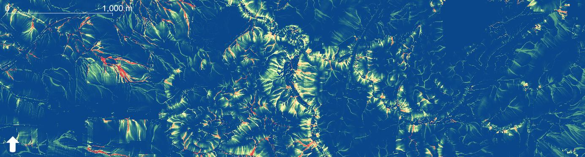

# SCIMAP Toolkit QGIS Plugin

This plugin provides the SCIMAP sediment, network index, and flood workflows inside QGIS Processing.
It is a native QGIS companion to the SCIMAP web app and legacy flood workflow.

It calculates:
- Erosion Risk (raster)
- Network Connectivity Risk (raster)
- In-Channel Risk (raster)
- Vector Stream Network (vector)
- SCIMAP Flood Mean (raster)
- SCIMAP Flood Standard Deviation (raster)

The algorithm uses native WhiteboxTools calls for hydrological operations, including:
- BreachDepressions
- Slope
- FD8FlowAccumulation
- D8Pointer
- ExtractStreams
- RasterStreamsToVector
- DownslopeDistanceToStream

The plugin also provides separate tools:
- SCIMAP Network Index from DEM (raster output)
- SCIMAP Flood from pre-computed connectivity, runoff, rainfall, and overland flow distance rasters

Flood outputs are the mean and standard deviation rasters.

## What The Plugin Does

The sediment workflow runs a SCIMAP-style source-to-stream routing workflow from three raster inputs:
- Digital Elevation Model (DEM)
- Land Cover risk weighting raster
- Rainfall raster

High-level process:
1. Fill/breach DEM depressions.
2. Compute slope, FD8 flow accumulation, and D8 flow directions.
3. Compute erosion risk.
4. Compute network connectivity using flow-path trace.
5. Compute FD8-based rainfall-weighted and routed source-risk proxies.
6. Compute in-channel risk as routed risk divided by routed rainfall-weighted area.
7. Extract and vectorize stream network using a stream initiation threshold.

Network Index tool process:
1. Fill/breach DEM depressions.
2. Compute slope, FD8 flow accumulation, and D8 flow directions.
3. Compute network index using flow-path trace connectivity.
4. Write network index raster.

Flood tool process (mirrors pySCIMAP-Flood_2026.py, operating on pre-computed inputs rather than deriving them from a DEM):
1. Load a pre-computed connectivity raster and a runoff / land-cover weights raster.
2. Load all supplied rainfall pattern rasters (there is no Top-N selection step; every rainfall raster you provide is used).
3. Load all supplied overland flow distance rasters.
4. For each rainfall x overland-flow-distance combination, compute `normalise(rainfall) x (normalise(OFD) + 1.0)`, multiplied by connectivity x normalised runoff.
5. Write the mean and standard deviation across all combinations.

## Tool Summary

Use the plugin when you want:

- Sediment mapping from DEM, land cover, and rainfall rasters.
- A standalone network index from a DEM.
- Flood risk mapping from pre-computed connectivity, runoff, rainfall, and overland flow distance rasters.
- A standalone overland flow travel-distance raster to one or more points, for use as a Flood tool input or on its own.

## Requirements

- QGIS 3.28 to 4.x (tested on QGIS 4.0.1)
- WhiteboxTools executable available on your system
- Input rasters must be aligned (same extent, resolution, and CRS)

WhiteboxTools executable examples:
- macOS/Linux: `whitebox_tools` (no extension)
- Windows: `whitebox_tools.exe`

## Installing WhiteboxTools and Numba

WhiteboxTools is required. Numba is optional: it speeds up the Flood tool's raster combination step, and the plugin falls back to a pure NumPy implementation automatically if Numba is not installed.

### WhiteboxTools

Download the pre-compiled executable for your platform from the official downloads page (https://www.whiteboxgeo.com/download-whiteboxtools/) or the GitHub releases page (https://github.com/jblindsay/whitebox-tools/releases). You do not need to build it from source.

Once you have the executable, either:
- put it on your system PATH so the plugin can auto-detect it, or
- leave it wherever you like and paste the full path into the plugin's "WhiteboxTools executable" parameter the first time you run a SCIMAP tool (the plugin saves this path in QGIS settings and reuses it afterwards).

**Windows**
1. Download the Windows build (zip) and extract it, e.g. to `C:\WBT\`.
2. Confirm `whitebox_tools.exe` is present in that folder.
3. Either add `C:\WBT` to your system PATH, or supply the full path (`C:\WBT\whitebox_tools.exe`) in the plugin.

**macOS**
1. Download the macOS build (zip) and unzip it.
2. Make it executable: `chmod +x whitebox_tools`.
3. Gatekeeper may block the first run since the binary is unsigned. Either allow it via System Settings > Privacy & Security > "Allow Anyway" after the first blocked attempt, or clear the quarantine flag: `xattr -d com.apple.quarantine /path/to/whitebox_tools`.
4. Move it somewhere on PATH (e.g. `/usr/local/bin/`), or supply the full path in the plugin.

**Linux**
1. Download the Linux build (zip/tar.gz) and extract it.
2. Make it executable: `chmod +x whitebox_tools`.
3. Move it somewhere on PATH (e.g. `~/.local/bin/` or `/usr/local/bin/`), or supply the full path in the plugin.

### Numba

Numba must be installed into the same Python environment that QGIS uses to run Processing scripts, which is often not your system/default Python. To find it, open QGIS's Python Console (Plugins > Python Console) and run:
```python
import sys; print(sys.executable)
```
Then install Numba using that interpreter.

**Windows**
Open the OSGeo4W Shell (Start Menu > QGIS > OSGeo4W Shell) and run:
```
python -m pip install numba
```

**macOS**
Open Terminal and run pip using the Python bundled inside the QGIS app, for example:
```
/Applications/QGIS.app/Contents/MacOS/bin/python3 -m pip install numba
```
(Confirm the exact path with the `sys.executable` check above, as it can vary by QGIS version/install method.)

**Linux**
If QGIS was installed via your distro's package manager and uses the system Python:
```
python3 -m pip install --user numba
```
If QGIS was installed via Flatpak, install inside its sandbox instead:
```
flatpak run --command=bash org.qgis.qgis
pip install --user numba
```

## Installation

### Option 1: Install from Plugins Menu (recommended for normal use)
1. In QGIS, go to the 'Plugins' menu and select 'Manage and Install Plugins'
2. Search for 'SCIMAP Toolkit'
3. Click 'Install Plugin' and then click 'Close'
4. Access the tools wither under the Plugins menu, in the processing panel or via the toolbar icons  

### Option 2: Install from the QGIS plugin directory
1. Download this repo as a zip file.
2. In QGIS, go to Plugins > Manage and Install Plugins....
3. Choose Install from ZIP.
4. Select the plugin ZIP and install.
5. Enable the plugin if prompted.

## How To Use

You can run the algorithm from:
- Toolbar button: Run SCIMAP Standard
- Plugins menu: SCIMAP > Run SCIMAP Standard
- Processing Toolbox: SCIMAP > SCIMAP Sediment Diffuse Pollution Risk

You can also run the standalone network tool from:
- Processing Toolbox: SCIMAP > SCIMAP Network Index from DEM

You can run the flood tool from:
- Toolbar button: Run SCIMAP Flood
- Plugins menu: SCIMAP > Run SCIMAP Flood
- Processing Toolbox: SCIMAP > SCIMAP Flood

### Parameters

- Digital Elevation Model (DEM): elevation raster
- Land Cover Map / Risk Weighting: risk weighting raster
- Rainfall Map: rainfall raster
- Stream Initiation Threshold (m2): contributing area threshold for stream extraction (default: 800000)
- Flow routing is fixed to FD8 (no D-Infinity option).
- Connectivity is fixed to flow-path trace (Topological Netwet option removed).
- WhiteboxTools executable (optional): path to `whitebox_tools` binary

Flood tool parameters:
- Connectivity Raster (pre-computed)
- Runoff / Land Cover Weights Raster (pre-computed)
- Rainfall Pattern Rasters: all supplied rasters are used (no Top-N selection)
- Overland Flow Distance Rasters (pre-computed): one per impact point or scenario; generate these with the Overland Flow Distance to Point tool

If WhiteboxTools path is supplied, the plugin stores it in QGIS settings and reuses it on later runs.

### Outputs

- Network Connectivity Risk (raster)
- Erosion Risk (raster)
- In-Channel Risk (raster)
- Vector Stream Network (vector)

Standalone Network Index tool output:
- Network Index (raster)

Flood tool outputs:
- SCIMAP-Flood Mean (raster)
- SCIMAP-Flood Standard Deviation (raster)

## Tips

- Choose a stream threshold appropriate for raster resolution. The threshold is area-based and is converted internally to cell count.
- For very high-resolution DEMs, runtime can be long. Minutes to hours for large catchmnts (2000 km2 plus)
- If outputs look sparse or too dense, tune Stream Initiation Threshold first.

## Troubleshooting

- WhiteboxTools not found:
  - Set the WhiteboxTools executable parameter explicitly.
  - Confirm the file exists and is executable.
- WhiteboxTools executable appears unselectable in file dialog:
  - Use the plugin's executable selector with All files and select `whitebox_tools` directly.
- Processing fails with mismatched raster dimensions:
  - Reproject/resample inputs so DEM, land cover, and rainfall are aligned.

## Citation

Reaney, S., Lane, S., Heathwaite, A., and Dugdale, L. (2011).
Risk-based modelling of diffuse land use impacts from rural landscapes upon salmonid fry abundance. _Ecological Modelling_, 222(4), 1016-1029. https://doi.org/10.1016/j.ecolmodel.2010.08.022
