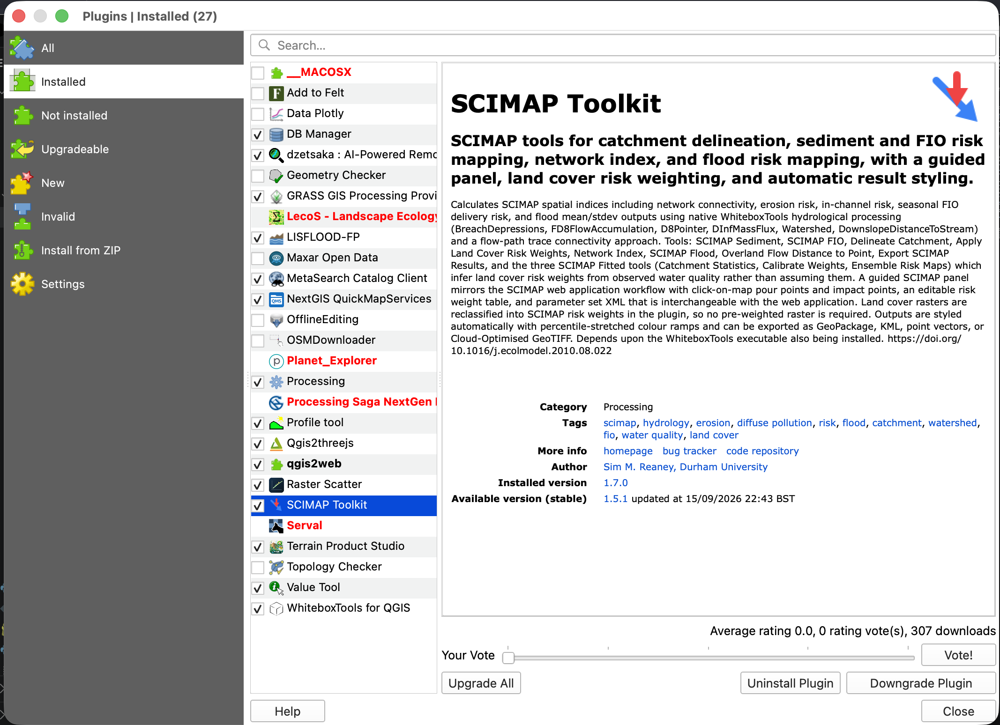
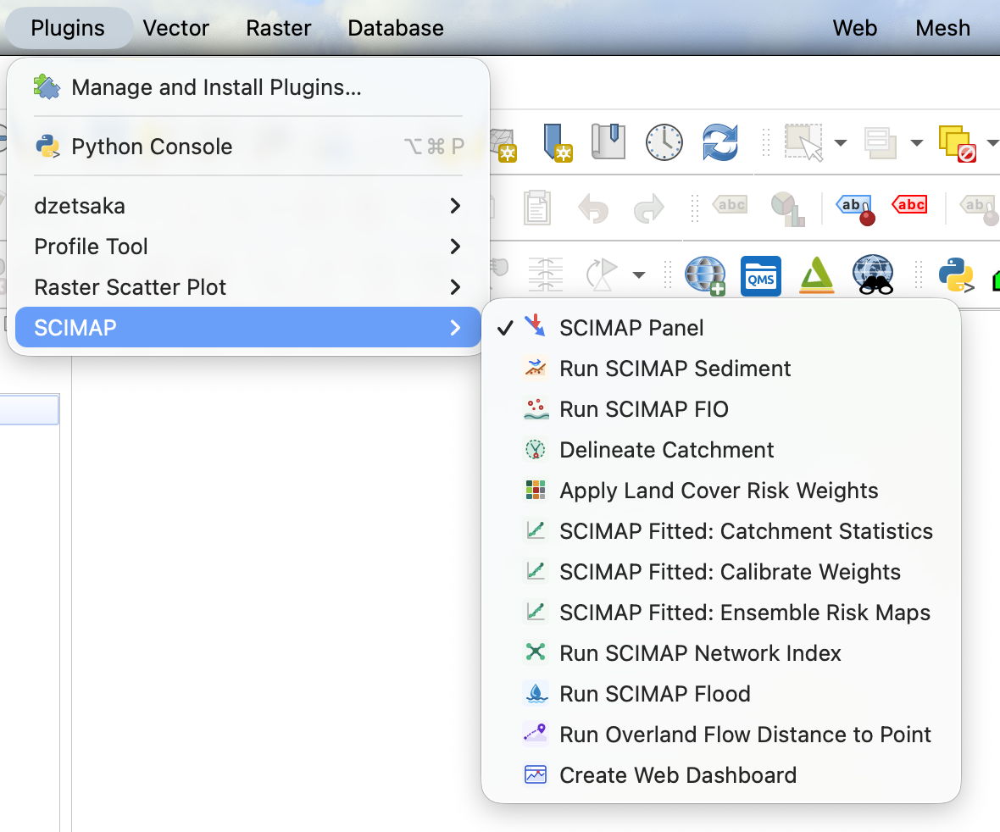
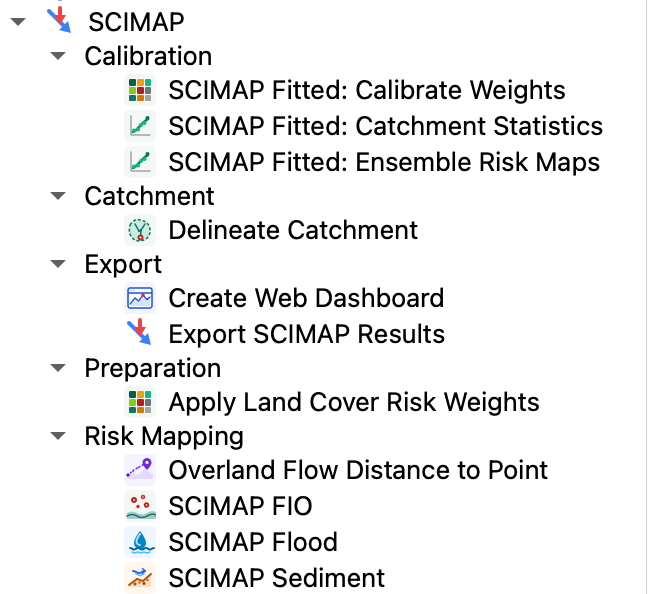

# Overview and Installation

## What the plugin does

The **SCIMAP Toolkit** brings the SCIMAP diffuse-pollution and flood-risk
models into QGIS as a set of Processing algorithms plus a guided panel. It
calculates network connectivity, erosion risk, in-channel risk, seasonal FIO
(faecal indicator organism) delivery risk, and flood mean/standard-deviation
outputs, using native WhiteboxTools hydrological processing (`BreachDepressions`,
`FD8FlowAccumulation`, `D8Pointer`, `DInfMassFlux`, `Watershed`,
`DownslopeDistanceToStream`) and a flow-path trace connectivity approach.

Land cover rasters are reclassified into SCIMAP risk weights inside the plugin,
so no pre-weighted raster needs to be prepared beforehand. Results are styled
automatically with percentile-stretched colour ramps and can be exported as
GeoPackage, KML, point vectors, Cloud-Optimised GeoTIFF, or a self-contained
offline web dashboard.

Reference: Reaney, S.M. et al. (2011) "Identifying critical source areas using
multiple methods for the prioritisation of agri-environment scheme
implementation", *Ecological Modelling*. https://doi.org/10.1016/j.ecolmodel.2010.08.022

## Requirements

- **QGIS** 3.28 – 4.99
- **WhiteboxTools** executable installed separately. The plugin's own
  Advanced parameters let you point at a specific `whitebox_tools` binary if it
  is not on your system PATH.

## Installing the plugin

Install like any other QGIS plugin, either from the QGIS Plugin Repository (if
published there) or manually:

1. Open **Plugins → Manage and Install Plugins…**
2. Either search for "SCIMAP Toolkit" and install it, or choose **Install from
   ZIP** and point at the plugin's `.zip` file.
3. Enable the **SCIMAP Toolkit** checkbox in the plugin list.

> Only install one copy at a time. If an unzipped development copy sits
> alongside the packaged plugin, QGIS refuses the duplicate Processing provider
> and the plugin logs a warning in the **Log Messages** panel instead of
> half-registering.

**Screenshot:**

*Plugins → Manage and Install Plugins, with SCIMAP Toolkit shown installed/enabled.*

## Where the plugin appears

Once enabled, SCIMAP adds itself in three places:

- **A toolbar** with an icon for the SCIMAP Panel and each of the eleven
  most-used tools.
- An **`&SCIMAP` entry in the Plugins menu**, listing the same panel toggle and
  tools.
- A **`SCIMAP` provider in the Processing Toolbox**, listing all twelve
  algorithms (including Export SCIMAP Results, which has no toolbar icon), so
  they can be run from there or chained into Processing models.

**Screenshot:**

*The SCIMAP toolbar, undocked or docked, showing all its icons in order.*

**Screenshot:**

*Plugins → SCIMAP, showing the panel toggle and every tool shortcut.*

**Screenshot:**

*Processing Toolbox → SCIMAP, expanded to show every algorithm and its group.*

## Two ways to work

- **The [SCIMAP Panel](01-scimap-panel.md)** is the guided route: a dockable
  panel with tabs that walk through catchment delineation, risk weight editing
  and running SCIMAP Sediment/FIO/Flood, with click-on-map point picking.
- **Individual Processing tools** (this guide's remaining pages) can be run one
  at a time from the toolbar, the `&SCIMAP` menu, or the Processing Toolbox —
  useful for scripting, batch processing, or when only one step is needed.

Continue to [The SCIMAP Panel](01-scimap-panel.md).
