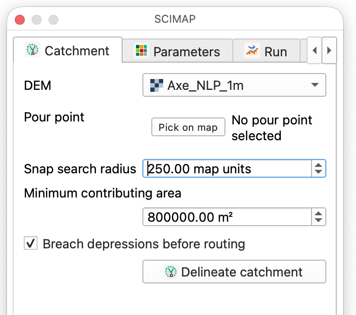
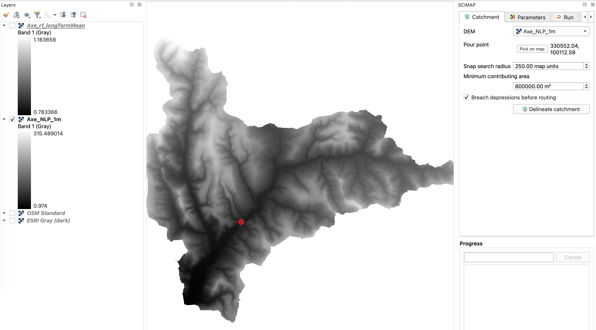

# The SCIMAP Panel

The SCIMAP Panel is a dockable QGIS panel that covers the workflow of the
SCIMAP mapping approach. You are able to click-on-map pour points and impact
points, an editable risk weight table, and parameter set XML that is
interchangeable with the web application. It wraps the same Processing
algorithms documented elsewhere in this guide, so anything done here can also
be done — with more parameters exposed — from the individual tools.

## Opening the panel

Click the SCIMAP icon on the toolbar, or **Plugins → SCIMAP → SCIMAP Panel**.
The panel docks to the right-hand side of the QGIS window by default and can be
dragged, floated or closed like any other dock widget.

**Screenshot:**

*The whole panel docked in the QGIS main window, wide enough to show its tab bar.*

The panel has five tabs — **Catchment**, **Parameters**, **Run**, **Flood**,
**Results** — plus a **Progress** section with a progress bar, a Cancel button
and a run log that stays visible under every tab.

## Catchment tab

Delineates the catchment upstream of a pour point — the same operation as the
standalone [Delineate Catchment](02-delineate-catchment.md) tool, exposed with
a simpler parameter set for the guided workflow.

**Fields:**

| Field | Description |
|---|---|
| DEM | The Digital Elevation Model raster layer. |
| Pour point | Type coordinates, or click **Pick on map** and click the outlet location on the canvas. |
| Snap search radius | How far (map units) to search for a channel cell near the clicked point. Default 250. |
| Minimum contributing area | Upslope area (m²) a cell must have to count as "on the channel" when snapping. Default 800,000. |
| Breach depressions before routing | Fills DEM sinks before routing. On by default. |

Click **Delineate catchment** to run. The resulting catchment boundary is added
to the map and can then be selected as the optional **Catchment area** input on
the Run tab.

**Screenshot:**

*The Catchment tab, ideally with "Pick on map" active and a pour point marker visible on the canvas.*

## Parameters tab

Holds the risk weight per SCIMAP land cover class (1–7) that feeds the Run tab.
These weights can be shared with the SCIMAP web application as XML, so a
parameter set built in one can be reused in the other.

**Screenshot:**

*The Parameters tab: the class/land-cover/risk-weight table, the SCIMAP-classes checkbox, and the Reset/Import/Export buttons.*

- The table lists each SCIMAP class, its land cover label, and an editable risk
  weight spin box (0–1000, three decimal places).
- **Land cover already uses SCIMAP classes (1–7)** — tick when the land cover
  raster used later is already coded in SCIMAP's own 1–7 scheme, so no CEH-style
  remap is needed.
- **Reset to defaults** restores SCIMAP's default weights.
- **Import XML…** / **Export XML…** load or save a parameter set XML file,
  interchangeable with the SCIMAP web application's Parameters workspace.

## Run tab

Runs SCIMAP Sediment or SCIMAP FIO using the DEM, weights and optional
catchment boundary already set up on the other tabs.

**Fields:**

| Field | Description |
|---|---|
| Mapping type | SCIMAP Sediment or SCIMAP FIO. |
| Catchment area (optional) | A polygon layer to clip the run to — typically the output of the Catchment tab. |
| DEM | The Digital Elevation Model raster layer. |
| Land cover / FIO concentration | Label changes with Mapping type: a land cover raster for Sediment, or an FIO concentration (CFU) raster for FIO. |
| Rainfall | A rainfall raster. |
| Stream initiation threshold | Upslope area (m²) at which a channel is considered to start. Default 800,000. |
| Use stream power in erosion calculation | On by default. |
| Connectivity algorithm | Network Index (flow-path trace) or Percentage Downslope Saturated Length (PDSL). |
| Colour ramp | SCIMAP defaults per layer, or a specific ramp. |

Click **Run risk mapping** to run with these settings, or **Open in Processing
dialog…** to jump to the full [SCIMAP Sediment](04-scimap-sediment.md) /
[SCIMAP FIO](05-scimap-fio.md) dialog with every parameter exposed.

**Screenshot:**

*The Run tab with Mapping type, DEM, land cover and rainfall layers chosen.*

## Flood tab

Runs [SCIMAP Flood](07-scimap-flood.md) from pre-computed connectivity, runoff,
rainfall pattern and overland flow distance rasters, with impact points picked
on the map.

**Screenshot:**

*The Flood tab: connectivity/runoff layer combos, the rainfall and overland-flow-distance raster lists, and the Impact points group with markers visible on the canvas.*

**Fields:**

| Field | Description |
|---|---|
| Connectivity | A pre-computed connectivity raster (e.g. from Network Index). |
| Runoff / weights | A pre-computed runoff or land cover weights raster. |
| Rainfall pattern rasters | Select one or more from the list of loaded rasters. |
| Impact points | Click **Pick on map** to add one or more points, **Clear** to remove them, **Calc. OFD** to compute Overland Flow Distance rasters from them directly. |
| Overland flow distance rasters | Select one or more from the list of loaded rasters. |
| Refresh raster lists | Re-scans loaded layers for the rainfall/OFD lists above. |

Click **Run SCIMAP Flood** to produce the mean and standard-deviation flood
risk rasters described in [SCIMAP Flood](07-scimap-flood.md).

## Results tab

Lists every layer produced in the current panel session and offers quick
actions on the selected one, plus access to export and the web dashboard.

**Screenshot:**

*The Results tab: the session's layer list, the colour ramp row, Zoom/Export buttons, and the Web dashboard and Settings groups.*

- **Layers produced in this session** — every raster/vector this panel has
  created since it was opened.
- **Apply ramp** — recolour the selected layer with a chosen colour ramp.
- **Zoom to layer** / **Export…** — the latter opens
  [Export SCIMAP Results](09-export-scimap-results.md).
- **Web dashboard** group — **Build web dashboard…** opens
  [Create Web Dashboard](10-create-web-dashboard.md); **Build one after each
  run** asks where to save a dashboard automatically whenever a run finishes.
- **Settings** group — shows the resolved WhiteboxTools executable path and
  lets it be overridden.

## Picking points on the map

The Catchment tab's pour point and the Flood tab's impact points both use the
same click-to-pick interaction: press **Pick on map**, click once (pour point)
or repeatedly (impact points) on the canvas, and a marker is drawn at each
picked location. This avoids typing coordinates by hand, and is the same
interaction the SCIMAP web application uses for its map. Right-click or
untoggle the button to stop picking.

Continue to [Delineate Catchment](02-delineate-catchment.md), or jump to any
tool in the [index](README.md).
